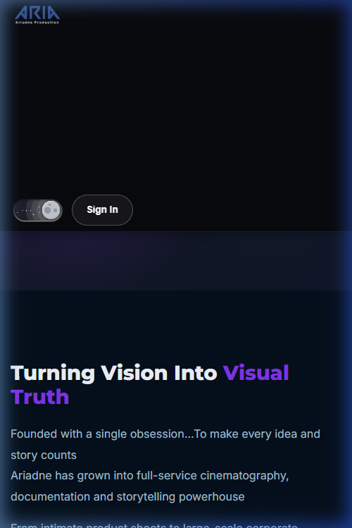

# Project Brand Color System

This skill contains the official color palette for the project. Always consult this palette when creating or updating any visual elements to maintain color consistency across the website.

## Official Palette

*   **Navy Blue**: Primary brand color. Hex: `#1e3a8a`
*   **Black**: Structural color. Hex: `#000000`
*   **White**: Structural color. Hex: `#ffffff`
*   **Golden / Beige**: Accent color. Hex: `#d4b483`
*   **Soft Sage Green**: Accent color. Hex: `#a8b3a0`
*   **Baby Blue**: Accent color. Hex: `#7dd3fc`

## Rules for Maintaining Color Consistency

1.  **Strict Adherence**: Only use colors defined in this palette. Do not use generic browser colors or unapproved hex values.
2.  **Visual Hierarchy**: Use primary colors (Navy Blue, Black, White) for structure, backgrounds, and main text.
3.  **Accent Usage**: Use accent colors (Golden/Beige, Soft Sage Green, Baby Blue) strategically for buttons, active states, hover effects, icons, gradients, and decorative elements.
4.  **No Blind Replacements**: Do not blindly replace every existing color with one palette color. Apply colors with a sense of modern UI design, ensuring proper contrast and hierarchy.
5.  **Dynamic Theming**: If you need gradient text or dynamic colors (e.g. for user names), rely on CSS variables mapped to these exact palette values.
6.  **Dark Mode Overrides**: Ensure text remains readable (e.g., using White or very light shades) if a dark background (Black or Navy Blue) is applied.

## Visual Reference

